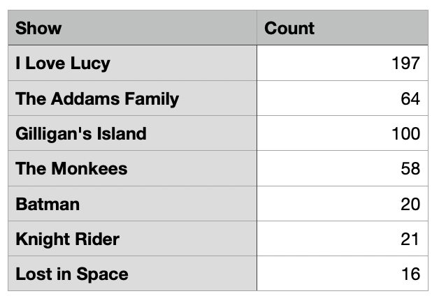
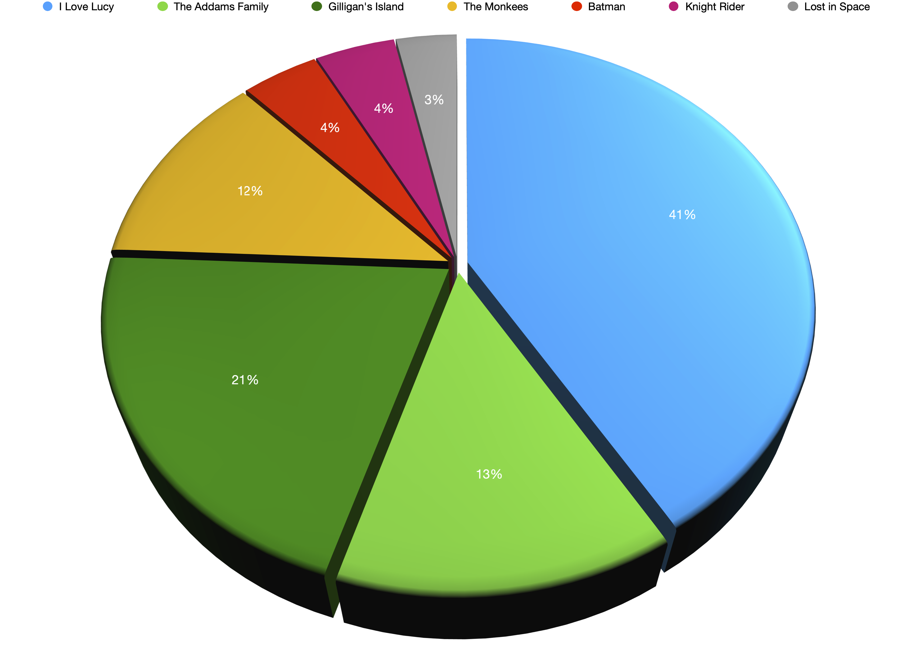

# Plex Sickday Playlist Generator

<https://github.com/BrianEnigma/PlexSickdayPlaylist>

Plex Sickday Playlist Generator © 2024 by [Brian Enigma](https://brianenigma.com) 
is licensed under Creative Commons Attribution-NonCommercial-ShareAlike 4.0 
International. To view a copy of this license, visit <https://creativecommons.org/licenses/by-nc-sa/4.0/>

## Overview

Make a playlist (queue) of shows in Plex, evenly weighted by the show, not the 
number of episodes in any given show.

## Background

This is a Python script to generate what I call a “Sickday Playlist.” Plex has
the concept of a playlist and you can put a bunch of TV show episodes in there 
and then put it it on shuffle, but there are a few flaws there. 

I grew up watching syndicated television in the 80s. On days that I was home
sick, I'd put on the TV and watch things like I Love Lucy, The Twilight Zone,
Gilligan's Island, and The Monkees. I've been accumulating shows on DVD (and 
Bluray) over the decades and have added a lot of them to my Plex server. Many
years ago, I had the bright idea to make a playlist of all those shows.

But the way Plex works when shuffling playlists is that it just picks a random 
entry from the list and plays it. This becomes a problem when one show has a 
lot more episodes than another — because of either the number of years it was
on TV or the number of seasons you own on disc.

Case in point, here's a chart of the number of episodes of some shows in my
previous sickday playlist:



We can graph this, too:



As you can see from the graph, if you just shove all of the episodes of all
of the shows into a Plex playlist and put it on random, then almost every other
episode will be I Love Lucy. That's a bit much.

So I had the thought that I'd write a script to build a playlist that acts
like a queue (not to be shuffled, but to be played in order).

## Playlist Generation

This script is configurable, but by default it:

- Creates a playlist name `SickdayQueue` if it doesn't exist.
- For twenty shows:
    - Take the list of shows you want to use (irregardless of number of episodes).
    - Pick one at random. It can't be the previous one you picked.
    - Within that show's episodes, pick one at random.
    - Add that to the playlist.

In this way, the entries in the queue aren't weighted by the number of episodes
in a given show. It should be balanced, with no two episodes of the same show
back-to-back.

## Setup

```
python -m venv ./venv
source ./venv/bin/activate
python -m pip install -r requirements.txt
cp config-example.py config.py
```

Edit `config.py`:

- Put in your local server's name or IP address.
- Paste in the authentication token. See: <https://support.plex.tv/articles/204059436-finding-an-authentication-token-x-plex-token/>
- If needed, edit the name of your Plex library that holds television shows (by 
  default `TV Shows`)
- If needed, edit the name of the playlist.
- Edit the list of shows. These should match shows you have in your `TV Shows` (or
  otherwise Plex library)

## Usage

```
usage: generate_playlist.py [-h] [-c COUNT] [-e]

Generate a Plex playlist for sickdays.

options:
  -h, --help            show this help message and exit
  -c COUNT, --count COUNT
                        Number of items to add to the sickday playlist
  -e, --erase           Whether to erase the existing playlist before adding

See the README for more detailed information.
```

- **count** is the number of episodes to add to your playlist. By default, this
  is 20.
- **erase** is used to remove the current content of the playlist, replacing it 
  with these new entries. Otherwise, if there is a pre-existing playlist, it will
  be appended to.
